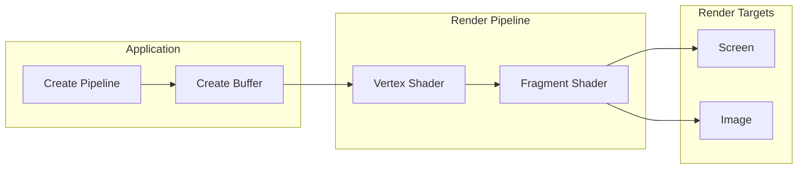
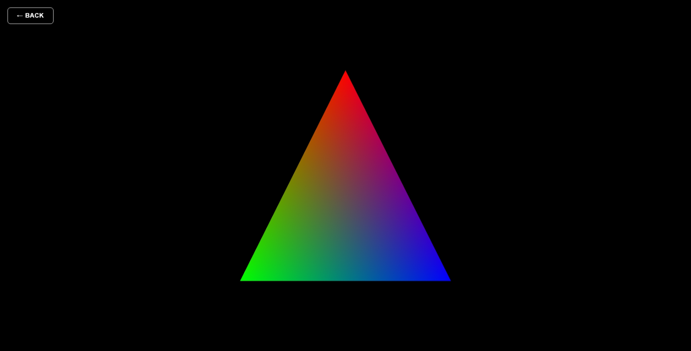
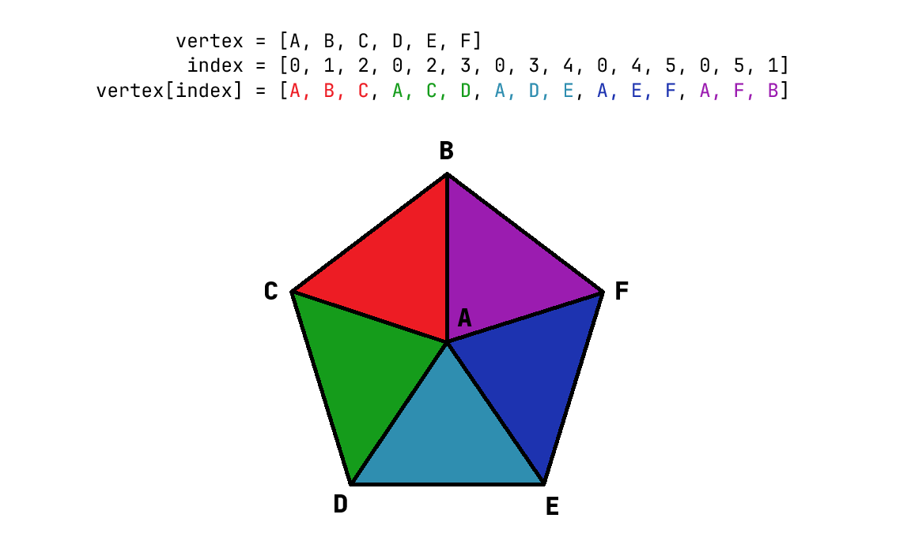
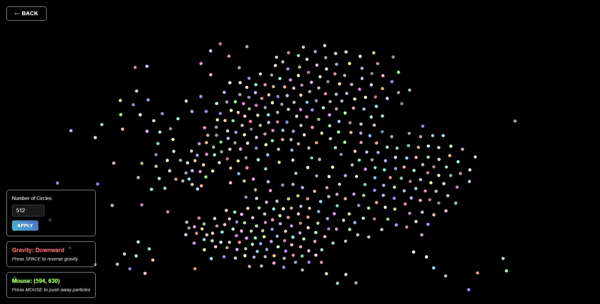

# WebGPU Summer Workshop: Synthetic Animation & Simulation in the Browser

This repository holds the code and resources for the WebGPU Summer Workshop, focusing on creating synthetic animations in the browser using WebGPU.

This README provides all the materials for the workshop.

## Introduction

[WebGPU](https://developer.mozilla.org/en-US/docs/Web/API/WebGPU_API) is an API standard developed by the [W3C](https://www.w3.org/) committee to provide a more modern way to access the GPU through browsers.

While there is [WebGL](https://developer.mozilla.org/en-US/docs/Glossary/WebGL) for rendering graphics in the browser, WebGPU provides a lower-level interface and is designed to be more efficient and powerful, allowing developers to create complex graphics applications directly in the browser.

> [!NOTE]
>
> WebGPU is still in development and not yet widely supported in all browsers. Check the [WebGPU implementation status page](https://github.com/gpuweb/gpuweb/wiki/Implementation-Status) for the latest updates on browser support.
>
> At the time of writing, WebGPU is only generally available in chromium-based browsers like Chrome and Edge. Firefox and Safari require enabling experimental features to use WebGPU.

## Workshop Overview

This workshop is designed for anyone with a basic understanding of programming. We will explore the WebGPU API and how to use it to create graphics and interactive animations in the browser. Therefore, most of the code has already been implemented for you, you will only need to fill in the most essential parts.

This workshop is structured as follows:

1. Implement traditional render pipeline that renders a simple triangle.
2. Implement compute pipeline to simulate physics.
3. Implement interaction with the simulation to create a synthetic animation.

> [!NOTE]
>
> This workshop will only focus on the WebGPU API in JavaScript in the [triangle](./triangle/) and [particles](./particles/) pages, we will not cover the basics of web development like HTML and CSS.

## Getting Started

To get started with the workshop, follow these steps:

1. Clone this repository:
   ```bash
   git clone https://github.com/LioQing/webgpu-summer-workshop-2025.git
   ```
2. Checkout the `scaffold` branch:
   ```bash
   git checkout scaffold
   ```
3. Open the `index.html` file in a browser.
    - If you are using Visual Studio Code, you can install the [Live Server](https://marketplace.visualstudio.com/items?itemName=ritwickdey.LiveServer) extension to see changes in real-time.
    - If you are using another editor, you can use Python's built-in HTTP server:
      ```bash
      python -m http.server 8000
      ```

> [!NOTE]
>
> I vibe coded 90% of the code in this workshop, but I reviewed 100% of the code, so feel free to ask questions if you have any doubts about the code.

## Triangle Rendering

In the first part of the workshop, we will implement a traditional rendering pipeline to render a simple triangle using WebGPU.

### Terminology

First, let's define some key terms related to graphics programming:

- **Render Pipeline**: a sequence of instructions for GPU to render graphics.
    - **Vertex**: a position in space.
    - **Fragment**: a pixel in the final image.
- **Shader**: a program that run on the GPU to process things.
- **Buffer**: a piece of memory storage on the GPU.
    - **Vertex Buffer**: a buffer with an array of vertices.
    - **Uniform Buffer**: a buffer with data that can be read by shaders.
- **Bind Group**: a collection of buffers and textures that is defined for a shader to access.

### Render Pipeline

Then, let's take a look at what a render pipeline looks like:



> [!NOTE]
>
> If the application already created all the data in the buffer, why do we need to run the shaders?
>
> Sometimes, we may want to modify the data on GPU instead of CPU, for example, to rotate an entire object with a lot of vertices, CPU just need to pass all the initial vertex positions in the vertex buffer and the rotation in a uniform buffer, and GPU can do it in parallel, which is much faster than CPU doing it one by one.

While there are a lot of different types of shaders, vertex and fragment shaders are the most fundamental ones for rendering graphics.

> [!NOTE]
>
> Why are there different types of shaders?
>
> Shaders are designed to run on different stages of the rendering pipeline, each with its own specific purpose. GPUs can specialize their hardware for different types of shaders, allowing for more efficient processing of graphics data.

### WebGPU Render API

Let's open [triangle/triangle.js](./triangle/index.js) and take a look at the code.

```javascript
let renderPipeline; // The render pipeline for drawing the triangle
let vertexBuffer; // The vertex buffer containing triangle vertices
let uniformsBuffer; // The uniforms buffer for screen resolution
let bindGroup; // The bind group for passing uniforms to the shader

// Resize the canvas and update buffers
function resizeCanvas()

// Create uniforms buffer for screen resolution
function createUniformsBuffer()

// Update uniforms buffer with current canvas resolution
function updateUniformsBuffer()

// Create vertex buffer
function createVertexBuffer()

// Update vertex buffer with current canvas resolution
function updateVertexBuffer()

// Create bind group for render pipeline
function createBindGroup()

// Create render pipeline for triangle rendering
async function createRenderPipeline()

// Run render shader to draw the triangle
function runRenderShader()

// Update function to render the triangle
function update() {
    // ...
    
    // Run render shader to draw triangle
    if (renderPipeline) {
        runRenderShader();
    }

    // Request next frame
    requestAnimationFrame(update);
    
    // ...
}

// Initialize WebGPU
async function init() {
    // ...

    // Initialize device and context
    await initDeviceAndContext();

    // Configure context
    configureContext();

    // Create uniform buffer
    createUniformsBuffer();
    
    // Create vertex buffer
    createVertexBuffer();

    // Create render pipeline
    await createRenderPipeline();
    
    // Create bind group
    createBindGroup();
    
    // Start render loop
    update();

    // ...
}
```

We can break down the code into several key parts:

1. Initializing the device and context
   ```javascript
   // Initialize device and context
   await initDeviceAndContext();
   
   // Configure context
   configureContext();
   ```
    - Device represents the GPU which lets us create resources and run shaders.
    - Context is an object that tells the GPU to render to a specific canvas.
    - [utils.js](./utils.js) contains utility functions to initialize them so we can focus on the rendering logic instead of the setup.
2. Create the buffers
   ```javascript
   // Create uniform buffer
   createUniformsBuffer();
   
   // Create vertex buffer
   createVertexBuffer();
   ```
    - We create buffers to store uniforms and vertices.
    - The uniforms hold the screen resolution for reason that will be explained in [the next section](#triangle-render-shader).
    - The vertex buffer holds the vertex positions and colors of the triangle.
    - The buffers are created using the device's [`createBuffer`](https://developer.mozilla.org/en-US/docs/Web/API/GPUDevice/createBuffer) method.
    - The buffers are then written to using the device queue's [`writeBuffer`](https://developer.mozilla.org/en-US/docs/Web/API/GPUQueue/writeBuffer) method.
    - Queues are used to submit commands/instructions to the GPU, they are not executed immediately, but rather scheduled for execution later using the [`submit`](https://developer.mozilla.org/en-US/docs/Web/API/GPUQueue/submit) method.
3. Create the render pipeline and bind group
   ```javascript
   // Create render pipeline
   await createRenderPipeline();
   
   // Create bind group
   createBindGroup();
   ```
    - The render pipeline is created using the device's [`createRenderPipeline`](https://developer.mozilla.org/en-US/docs/Web/API/GPUDevice/createRenderPipeline) method.
    - In the pipeline descriptor, we need to specify the vertex and fragment shaders, the bind group layout, and the topology of the geometry.
    - WebGPU API in JavaScript allows us to automatically detect the shader's bind group layout, which simplifies a lot of the boilerplate code.
    - The topology is set to `triangle-list`, which will render every 3 vertices as a triangle.
    - The bind group is created using the device's [`createBindGroup`](https://developer.mozilla.org/en-US/docs/Web/API/GPUDevice/createBindGroup) method, which binds the buffers to the pipeline.
4. Finally, we update every frame to render the triangle, which also responds to canvas resize
   ```javascript
   // Run render shader to draw triangle
   if (renderPipeline) {
       runRenderShader();
   }

   // Request next frame
   requestAnimationFrame(update);
   ```
    - To run the shader, we need to call the device's [`createCommandEncoder`](https://developer.mozilla.org/en-US/docs/Web/API/GPUDevice/createCommandEncoder) method to create a [`GPUCommandEncoder`](https://developer.mozilla.org/en-US/docs/Web/API/GPUCommandEncoder), and then use the encoder's [`beginRenderPass`](https://developer.mozilla.org/en-US/docs/Web/API/GPUCommandEncoder/beginRenderPass) method to create a render pass.
    - The render pass is where we specify the render targets (the canvas) and the bind group to use.
    - We will use the pass' [`setPipeline`](https://developer.mozilla.org/en-US/docs/Web/API/GPURenderPassEncoder/setPipeline) method to set the render pipeline, the [`setBindGroup`](https://developer.mozilla.org/en-US/docs/Web/API/GPURenderPassEncoder/setBindGroup) method to set the bind group, the [`setVertexBuffer`](https://developer.mozilla.org/en-US/docs/Web/API/GPURenderPassEncoder/setVertexBuffer) method to set the vertex buffer, and finally the [`draw`](https://developer.mozilla.org/en-US/docs/Web/API/GPUCommandEncoder/draw) method to draw the triangle.
    ```javascript
    // Run render shader to draw the triangle
    function runRenderShader() {
        // Get current texture from canvas
        const currentTexture = gpuState.context.getCurrentTexture();
        
        // Create render pass descriptor
        const renderPassDescriptor = {
            label: 'Triangle render pass',
            colorAttachments: [{
                view: currentTexture.createView(),
                clearValue: { r: 0.0, g: 0.0, b: 0.0, a: 1.0 },
                loadOp: 'clear',
                storeOp: 'store'
            }]
        };

        // Create command encoder
        const encoder = gpuState.device.createCommandEncoder({
            label: 'Triangle command encoder'
        });

        // Create render pass
        const renderPass = encoder.beginRenderPass(renderPassDescriptor);
        
        // Set pipeline, bind group, and vertex buffer
        renderPass.setPipeline(renderPipeline);
        renderPass.setBindGroup(0, bindGroup);
        renderPass.setVertexBuffer(0, vertexBuffer);
        
        // Draw triangle
        renderPass.draw(3);
        
        // End render pass
        renderPass.end();

        // Submit commands
        gpuState.device.queue.submit([encoder.finish()]);
    }
    ```

### Triangle Render Shader

Shaders in WebGPU are written in a language called [WGSL](https://www.w3.org/TR/WGSL/), which is a shading language designed for WebGPU.

Let's take a look at the vertex and fragment shaders in [triangle/triangle.wgsl](./triangle/triangle.wgsl):

```wgsl
struct Uniforms {
    resolution: vec2<f32>,
}

struct VertexInput {
    @location(0) position: vec2<f32>,
    @location(1) color: vec3<f32>,
}

struct FragmentInput {
    @builtin(position) position: vec4<f32>,
    @location(0) color: vec3<f32>,
}

@group(0) @binding(0) var<uniform> uniforms: Uniforms;

@vertex
fn vs_main(input: VertexInput) -> FragmentInput {
    var out: FragmentInput;
    
    // ...

    return out;
}

@fragment
fn fs_main(input: FragmentInput) -> @location(0) vec4<f32> {
    return vec4<f32>(input.color, 1.0);
}
```

We can take a look at each part of the shader:

1. Define structs and bind groups
    ```wgsl
    struct Uniforms {
         resolution: vec2<f32>,
    }
    
    struct VertexInput {
         @location(0) position: vec2<f32>,
         @location(1) color: vec3<f32>,
    }
    
    struct FragmentInput {
         @builtin(position) position: vec4<f32>,
         @location(0) color: vec3<f32>,
    }
    
    @group(0) @binding(0) var<uniform> uniforms: Uniforms;
    ```
     - We define a `Uniforms` struct to hold the screen resolution.
     - The `VertexInput` struct holds the vertex position and color, while the `FragmentInput` struct holds the position and color for the fragment shader.
     - The `@location` attribute specifies the input/output locations for the vertex and fragment shaders.
     - The `@builtin(position)` attribute specifies that the position is a built-in output for the vertex shader, which will be used to determine where the vertex is drawn on the screen.
     - These structs must match the layout of the buffers we created in JavaScript.
     - The `@group` and `@binding` attributes specify the group and binding of the buffer, which lets us to organize our resources.
2. Calculate normalized device coordinates (NDC) in the vertex shader
   ```wgsl
   @vertex
   fn vs_main(input: VertexInput) -> FragmentInput {
       var out: FragmentInput;
       
       let ndc = (input.position / uniforms.resolution) * 2.0 - 1.0;
       let flipped_ndc = vec2<f32>(ndc.x, -ndc.y);
       
       out.position = vec4<f32>(flipped_ndc, 0.0, 1.0);
       out.color = input.color;
       return out;
   }
   ```
    - The vertex shader function is annotated with `@vertex`.
    - The vertex shader takes the `VertexInput` and outputs `FragmentInput`.
    - It converts the vertex position from pixel coordinates to normalized device coordinates(NDC) by scaling it to the range [-1, 1] with the given screen resolution in the uniforms buffer.
    - The color is passed directly to the fragment shader.
3. Simply output the color in the fragment shader
   ```wgsl
   @fragment
   fn fs_main(input: FragmentInput) -> @location(0) vec4<f32> {
       return vec4<f32>(input.color, 1.0);
   }
   ```
    - The fragment shader function is annotated with `@fragment`.
    - The fragment shader takes the `FragmentInput` and outputs a color.
    - It simply returns the color with an alpha value of 1.0 (fully opaque).
    - The color will be linearly interpolated between the vertices of the triangle, which is the default behavior in most graphics APIs.

### Triangle

After finishing everything, you should be able to see a triangle with red, green, and blue colors on the page.



## Particles Simulation

In the second part of the workshop, we will implement a compute pipeline to simulate particles physics, and render them using the render pipeline we learned in the first part.

Compute shader is a more general-purpose shader to perform arbitrary computations on the GPU, and is not limited to rendering graphics, thus these are generally referred to as [general-purpose computing on GPUs (GPGPU)](https://en.wikipedia.org/wiki/General-purpose_computing_on_graphics_processing_units). In machine learning and scientific computing, [CUDA by NVIDIA](https://en.wikipedia.org/wiki/CUDA) is a very popular GPGPU API and it is specialized for NVIDIA GPUs.

### Terminology

First, let's learn some new terms which we will use in this part of the workshop:

- **Compute Pipeline**: a sequence of instructions for GPU to compute data, similar to render pipeline but is more general-purposed.
- **Storage Buffer**: a buffer that can be read and written by shaders, it is able to hold much more data than a uniform buffer.
- **Index Buffer**: a buffer with an array of indices telling the GPU how to access the vertices in the vertex buffer, instead of going through the vertices one by one, it is like going through the indices then access the vertex using the index.
  ```python
  for index in indices:
      vertex = vertices[index]
      # Do something with the vertex
  ```
  
- **Instancing**: a technique for render pipeline to render multiple geometries with the same vertex buffer, we can use the instance index to access the instance's own data in whatever buffer we want.
  ```python
  for instance_index in range(num_instances):
    for index in indices:
        vertex = vertices[index]
        our_instance_data = our_instance_buffer[instance_index]
        # Do something with the vertex and instance data
  ```

### WebGPU Compute API

Let's open [particles/particles.js](./particles/index.js) and take a look at the code.

```javascript
// WebGPU variables
let renderPipeline; // The render pipeline for drawing the circles
let computePipeline; // The compute pipeline for moving the circles
let vertexBuffer; // The vertex buffer containing circle geometry
let indexBuffer; // The index buffer for circle triangles
let circleBuffer; // The buffer containing circle data (position, color, velocity)
let uniformsBuffer; // The uniforms buffer for screen resolution
let timeBuffer; // The time buffer for delta time
let bindGroup; // The bind group for passing uniforms to the shader
let computeBindGroup; // The bind group for the compute pipeline

// Circle configuration
let num_circles = 128;
const CIRCLE_RADIUS = 5;
const CIRCLE_SEGMENTS = 16; // Number of triangles to approximate a circle
const CIRCLE_SPAWN_RADIUS = 1.5 * CIRCLE_RADIUS; // Minimum distance between circles
const SPEED = 60.0; // Movement speed in pixels per second
let circles = []; // Array to store circle data (position, color, velocity)

// Gravity state
let isGravityReversed = false;

// Update gravity status display
function updateGravityDisplay()

// Resize the canvas and update buffers
function resizeCanvas()

// Create uniforms buffer for screen resolution
function createUniformsBuffer()

// Update uniforms buffer with current canvas resolution
function updateUniformsBuffer()

// Create vertex buffer for circle geometry
function createVertexBuffer()

// Generate random circles
function generateCircles()

// Create circle buffer for circle data
function createCircleBuffer()

// Update circle buffer with current circle data
function updateCircleBuffer()

// Create time buffer for delta time
function createTimeBuffer()

// Update time buffer with delta time
function updateTimeBuffer(deltaTime)

// Create render pipeline for particle rendering
async function createRenderPipeline()

// Create compute pipeline for particle movement
async function createComputePipeline()

// Create bind groups for render and compute pipelines
function createBindGroups()

// Run render shader to draw particles
function runRenderShader()

// Run compute shader to update particle positions
function runComputeShader(deltaTime)

// Restart simulation with new number of circles
async function restartSimulation(newNumCircles)

// Update function to render the circles
let lastTime = 0;
function update(currentTime = 0) {
    // ...
    
    // Calculate delta time
    const deltaTime = (currentTime - lastTime) / 1000; // Convert to seconds
    lastTime = currentTime;

    // Run compute shader to update particle positions
    // Cap delta time to prevent large jumps and ensure minimum time has passed
    if (computePipeline && deltaTime > 0.001 && deltaTime < 0.1) {
        runComputeShader(deltaTime);
    }

    // Run render shader to draw particles
    if (renderPipeline) {
        runRenderShader();
    }

    // Request next frame
    requestAnimationFrame(update);
    
    // ...
}

// Initialize WebGPU
async function init() {
    // ...

    // Initialize device and context
    await initDeviceAndContext();

    // Configure context
    configureContext();

    // Create uniform buffer
    createUniformsBuffer();
    
    // Create vertex buffer (circle geometry)
    createVertexBuffer();
    
    // Create circle buffer (circle data)
    createCircleBuffer();
    
    // Create time buffer (delta time)
    createTimeBuffer();

    // Create render pipeline
    await createRenderPipeline();
    
    // Create compute pipeline
    await createComputePipeline();
    
    // Create bind groups
    createBindGroups();
    
    // Start render loop
    update();

    // ...
}
```

We can see the structure is actually very similar to the rendering code, only that we have two pipelines: one for rendering and one for computing. We just need to use the device's [`createComputePipeline`](https://developer.mozilla.org/en-US/docs/Web/API/GPUDevice/createComputePipeline) method to create the compute pipeline, and then use the encoder's [`beginComputePass`](https://developer.mozilla.org/en-US/docs/Web/API/GPUCommandEncoder/beginComputePass) method to create a compute pass.

Since in this program we are rendering a lot of circles, we can use instancing to render them efficiently by passing the number of instances as the second argument to the [`draw`](https://developer.mozilla.org/en-US/docs/Web/API/GPUCommandEncoder/draw) or [`drawIndexed`](https://developer.mozilla.org/en-US/docs/Web/API/GPUCommandEncoder/drawIndexed) method.

In this part, we will create a vertex buffer for the circle geometry and an index buffer for the circle triangles, so we will use the [`drawIndexed`](https://developer.mozilla.org/en-US/docs/Web/API/GPUCommandEncoder/drawIndexed) method.

```javascript
// Run render shader to draw particles
function runRenderShader() {
    // ...

    // Create render pass
    const renderPass = encoder.beginRenderPass(renderPassDescriptor);
    
    // Set pipeline, bind group, vertex buffer, and index buffer
    renderPass.setPipeline(renderPipeline);
    renderPass.setBindGroup(0, bindGroup);
    renderPass.setVertexBuffer(0, vertexBuffer);
    renderPass.setIndexBuffer(indexBuffer, 'uint32');
    
    // Draw instanced circles using indexed triangles
    // Each circle has CIRCLE_SEGMENTS triangles (3 indices each)
    const indicesPerCircle = CIRCLE_SEGMENTS * 3;
    renderPass.drawIndexed(indicesPerCircle, num_circles);
    
    // End render pass
    renderPass.end();

    // ...
}
```

For the compute shader, it is very similar as well.

The only difference is that we begin the pass with [`beginComputePass`](https://developer.mozilla.org/en-US/docs/Web/API/GPUCommandEncoder/beginComputePass) and we run it with the encoder's [`dispatchWorkgroups`](https://developer.mozilla.org/en-US/docs/Web/API/GPUCommandEncoder/dispatchWorkgroups) method, which takes the number of workgroups to run in parallel.

GPUs execute compute shaders in groups of threads called workgroups. In this case, we are setting the workgroup size to 128, this number need to match that defined in the [compute shader](#particle-movement-compute-shader). Since the circles need to be updated in groups, we take the ceil of the number of circles divided by the workgroup size to get the number of workgroups to run, and do not process anything for threads with their index larger than the number of circles.

Note that we are also passing the delta time to the compute shader, so that we can multiply the speed by the time to get the distance moved by each circle in that frame. You can see that it is in a different uniform buffer called `timeBuffer` rather than the `uniformsBuffer` we used in the render shader, this is good for separating data that is needed in different pipelines and shaders.

```javascript
// Run compute shader to update particle positions
function runComputeShader(deltaTime) {
    // ...

    // Update time buffer with current delta time
    updateTimeBuffer(deltaTime);

    // Create command encoder
    const encoder = gpuState.device.createCommandEncoder({
        label: 'Compute command encoder'
    });

    // Create compute pass
    const computePass = encoder.beginComputePass({
        label: 'Movement compute pass'
    });

    // Set compute pipeline and bind group
    computePass.setPipeline(computePipeline);
    computePass.setBindGroup(0, computeBindGroup);

    // Dispatch compute shader
    const workgroupSize = 128;
    const numWorkgroups = Math.ceil(num_circles / workgroupSize);
    computePass.dispatchWorkgroups(numWorkgroups);

    // End compute pass
    computePass.end();

    // ...
}
```

### Particle Render Shader

The render shader for the particles is very similar to the triangle render shader, but we will use instancing to render multiple circles at once.

For each circle, we can get the instance index by using the `@builtin(instance_index)` built-in variable on the vertex input, which is a special variable that gives us the index of the current instance being rendered.

Let's take a look at the particle render shader in [particles/particles.wgsl](./particles/particles.wgsl):

```wgsl
struct Uniforms {
    resolution: vec2<f32>,
}

struct Circle {
    position: vec2<f32>,
    velocity: vec2<f32>,
    acceleration: vec2<f32>,
    padding1: vec2<f32>,
    color: vec3<f32>,
    padding2: f32,
}

struct VertexInput {
    @location(0) position: vec2<f32>,
    @builtin(instance_index) instance_index: u32,
}

struct FragmentInput {
    @builtin(position) position: vec4<f32>,
    @location(0) color: vec3<f32>,
}

@group(0) @binding(0) var<uniform> uniforms: Uniforms;
@group(0) @binding(1) var<storage, read> circles: array<Circle>;

@vertex
fn vs_main(input: VertexInput) -> FragmentInput {
    var out: FragmentInput;
    
    // Get circle data using instance index
    let circle = circles[input.instance_index];
    
    // Transform local vertex position to world position
    let world_pos = input.position + circle.position;
    
    // Convert pixel coordinates to normalized device coordinates
    let ndc = (world_pos / uniforms.resolution) * 2.0 - 1.0;
    let flipped_ndc = vec2<f32>(ndc.x, -ndc.y);
    
    out.position = vec4<f32>(flipped_ndc, 0.0, 1.0);
    out.color = circle.color;
    return out;
}

@fragment
fn fs_main(input: FragmentInput) -> @location(0) vec4<f32> {
    return vec4<f32>(input.color, 1.0);
}
```

We can see that the vertex shader is very similar to the triangle vertex shader, but we are using the `instance_index` to get the circle data from the `circles` storage buffer, which is an array of `Circle` structs that we defined earlier.

Storage buffers are defined by same way as uniform buffers, but we need to define `var<storage, read>` to indicate that it is a storage buffer that can be read by the shader. The `Circle` struct contains the position, velocity, acceleration, and color of each circle.

Looking at how `world_pos` is defined, we can see that it is the sum of the local vertex position and the circle's position, this is the process of local to world positions transformation, which is a common practice in graphics programming.

### Particle Movement Compute Shader

For the most fun part, we are going to look at the compute shader that simulates the movement of the particles in [particles/movement.wgsl](./particles/movement.wgsl):

```wgsl
struct Uniforms {
    resolution: vec2<f32>,
    is_gravity_reversed: u32,
    padding: u32,
}

struct Circle {
    position: vec2<f32>,
    velocity: vec2<f32>,
    acceleration: vec2<f32>,
    padding1: vec2<f32>,
    color: vec3<f32>,
    padding2: f32,
}

@group(0) @binding(0) var<uniform> uniforms: Uniforms;
@group(0) @binding(1) var<storage, read_write> circles: array<Circle>;
@group(0) @binding(2) var<uniform> delta_time: f32;

const CIRCLE_RADIUS: f32 = 5.0;
const INTER_EPISILON: f32 = 100.0;
const INTER_SIGMA: f32 = CIRCLE_RADIUS * 8;
const MAX_SPEED: f32 = 1000.0;
const DAMPING: f32 = 0.999;
const DAMP_FREE_SPEED: f32 = 100.0;
const GRAVITY: f32 = 9.81 * 1000.0;

@compute @workgroup_size(128)
fn main(@builtin(global_invocation_id) global_id: vec3<u32>) {
    let index = global_id.x;
    let num_circles = arrayLength(&circles);
    
    if (index >= num_circles) {
        return;
    }
    
    // Get current circle data
    var circle = circles[index];
    
    // Simulate physics
    // ...
    
    // Update position using velocity and delta time
    circle.position += circle.velocity * delta_time;
    
    // Check boundaries and bounce
    // ...
    
    // Write back updated circle data
    circles[index] = circle;
}
```

First, while the bind group declarations are similar to the render shader, we have an additional `delta_time` uniform buffer to pass the delta time to the compute shader. We also specify `var<storage, read_write>` for the `circles` storage buffer, which allows us to read and write the circle data in the shader as we update their positions, velocity, and acceleration.

Next, notice that we have a `@compute` annotation on the shader function, which indicates that this is a compute shader. We also specify the workgroup size to be 128 via `@workgroup_size(128)`, which matches what we used in the JavaScript code when dispatching the compute shader.

Since there is no vertex input, we use the `@builtin(global_invocation_id)` built-in variable to get the global invocation ID, which is a unique ID for each thread running the compute shader. This is basically the index of the current thread regardless of the workgroup, so we can use it to index into the `circles` array.

After that, it's just a matter of defining constants and doing physics simulation, which is a lot of fun! Try to play around with the constants and code to see how the simulation behaves. One important thing to note is that since everything is executed in parallel, we should avoid race conditions, where multiple threads try to write to the same data at the same time.

### Interactive Controls

You may have noticed already that in the page there are two panels to control the number of circles and the gravity state.

We can make real-time changes to our simulation by either creating new buffers or updating existing ones. For example when we change the number of circles, we can simply call the `restartSimulation` function to create a new circle buffer with the new number of circles and update the render pipeline to use the new buffer.

```javascript
    // Add event listeners for circle controls
    const numCirclesInput = document.getElementById('num-circles-input');
    const applyButton = document.getElementById('apply-circles');
    
    if (numCirclesInput && applyButton) {
        applyButton.addEventListener('click', () => {
            const newNumCircles = numCirclesInput.value;
            restartSimulation(newNumCircles);
        });
        
        // Allow applying with Enter key
        numCirclesInput.addEventListener('keydown', (event) => {
            if (event.key === 'Enter') {
                event.preventDefault();
                const newNumCircles = numCirclesInput.value;
                restartSimulation(newNumCircles);
            }
        });
    }
```

### Particles

Finally, after finishing everything, you should be able to see a lot of circles bouncing around the page, and you can change the number of circles and toggle the gravity state.

